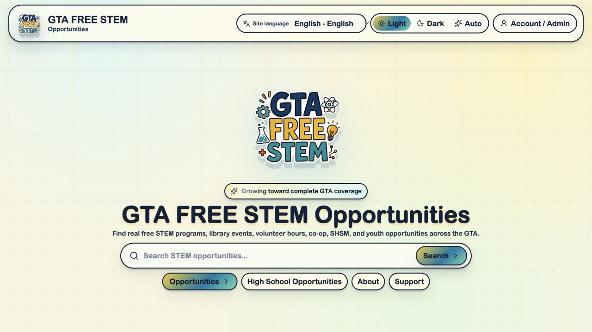
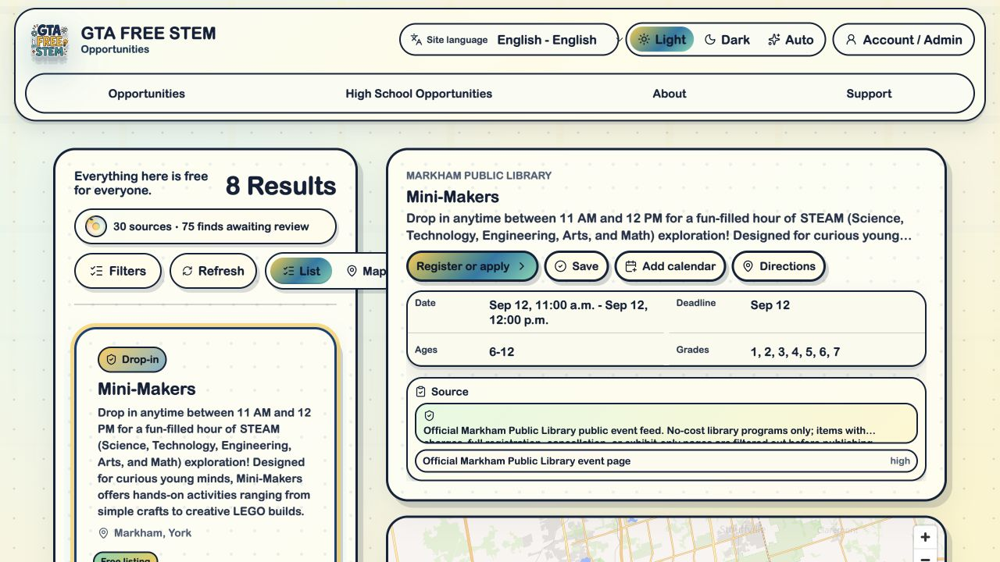
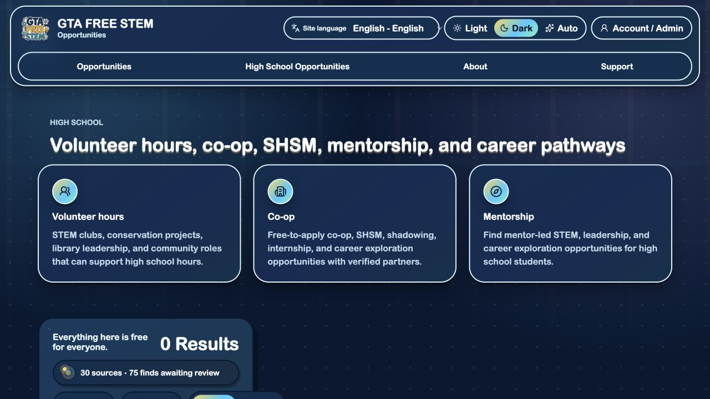
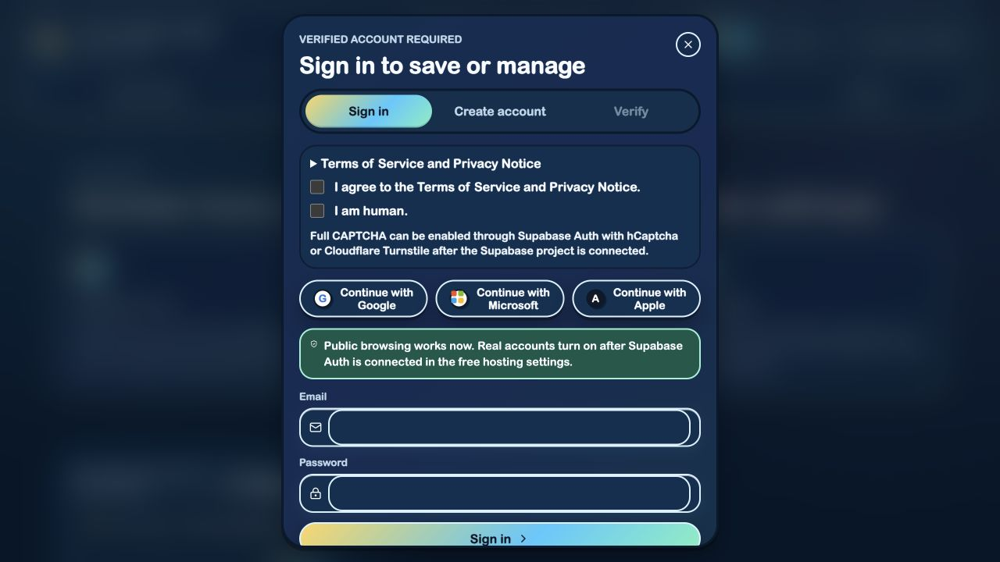

# GTA FREE STEM

I'm building GTA FREE STEM to help students and families find free STEM programs across the Greater Toronto Area. This repository contains the website and the opportunity feed used by the native apps.

[Open the website](https://gta-free-stem.vercel.app/) | [iOS app](https://github.com/rupayon123/gta-free-stem-ios) | [Android app](https://github.com/rupayon123/gta-free-stem-android)

## The web experience

<table>
<tr><th width="50%">Home</th><th width="50%">Search</th></tr>
<tr><td align="center"><a href="docs/showcase/home.png"></a></td><td align="center"><a href="docs/showcase/search.png"></a></td></tr>
<tr><th>High School Search</th><th>Profile / Sign in</th></tr>
<tr><td align="center"><a href="docs/showcase/hs-search.png"></a></td><td align="center"><a href="docs/showcase/profile.png"></a></td></tr>
</table>

## About the site

Browse programs by city, region, age, category, and language. The High School section covers volunteer hours, co-op, SHSM, mentorship, and career pathways. Listings include dates, provider information, source links, and a map where location data is available.

You don't need an account to browse. The profile area currently shows the sign-in screen; production accounts still need Supabase Auth connected. Account-based saves, feedback, submissions, and admin review depend on that setup.

The site uses Next.js and TypeScript, with MapLibre and OpenFreeMap for maps. It builds as a static export.

## Run locally

```bash
npm ci
npm run dev
```

To check and build the site:

```bash
npm run typecheck
npm run qa
npm run build
```

The static site is written to `out/`. Vercel uses the repository's `vercel.json`; Cloudflare Pages deployment is available through `npm run deploy:pages`.

## Accounts

Supabase is optional for public browsing. To connect account features, configure:

```bash
NEXT_PUBLIC_SUPABASE_URL=
NEXT_PUBLIC_SUPABASE_ANON_KEY=
```

Use `npm run supabase:check` to check the connection. Keep service-role keys, passwords, OAuth secrets, and deployment tokens out of the repository. Admin permissions must be enforced by database rules.

## Opportunity data

Listings come from public library, community, nonprofit, conservation, and education sources. Public search includes active listings with current or future dates. Expired and unreviewed finds stay out of the public results.

The [refresh workflow](.github/workflows/refresh-opportunities.yml) collects updates, checks source health, and runs QA and build checks before committing listing data. The native apps read the exported public feed in `public/opportunities.json`.

```bash
npm run discover
npm run discover:summary
npm run discover:sql
npm run generate:library
```

Generated translations are browsing summaries, not fully reviewed translations of every provider's content.

## Project layout

- `app/`: routes and pages.
- `components/`: interface components.
- `lib/`: search, filters, data types, and Supabase client.
- `scripts/`: feed refresh and build tools.
- `supabase/`: database schema.
- `public/`: feed and static assets.
- `docs/`: setup and deployment notes.

## Privacy and support

Location is optional and session-only. The public support flow is public, so don't include private or sensitive information. Under-13 account storage should remain disabled until a parent-consent flow is in place.

[Privacy policy](https://gta-free-stem.vercel.app/privacy/) | [Terms](https://gta-free-stem.vercel.app/terms/) | [Support](https://gta-free-stem.vercel.app/support/)

## Make it work for your city

Fork the project, replace the regions and source list, update the site metadata, and deploy the static export. Connect Supabase if you need accounts or admin review.

## License

[MIT](LICENSE) for the site's source and documentation. Program descriptions and third-party names and materials belong to their respective owners.
